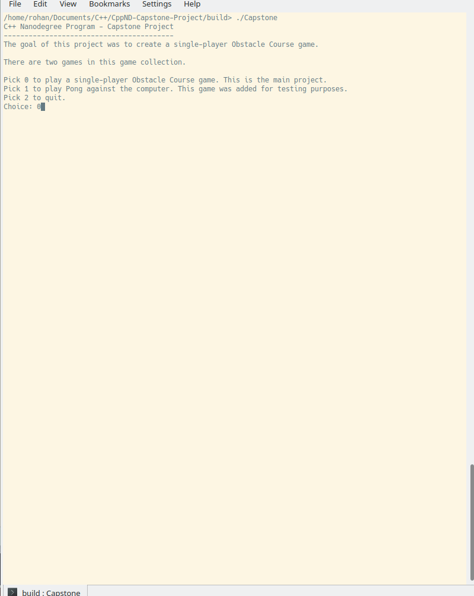

# CppND Capstone Project

This project is a C++ and SDL2 implementation of a single-player obstacle game. Option 1 was chosen; while SDL was used, this program was written from scratch. There is also a Pong game included that was used previously for testing purposes but is not the central goal of this project.  A major part of the code for this project involved building a small framework to make coding these two games easier.

## Dependencies

* cmake >= 3.11.3

* make >= 4.1 (Linux and Mac), 3.81 (Windows)

* gcc/g++ >= 5.4

* SDL2 library and extension libraries
	* SDL2
		* The SDL wiki contains install instructions for the SDL 2 library <a href="https://wiki.libsdl.org/Installation">here</a>.
			* Note that on Ubuntu, this package can be installed with the following command: `sudo apt install libsdl2-2.0-0 libsdl2-dev`
	* SDL2 extension libraries: SDL image, SDL ttf, and SDL mixer are all required for this project to run.
		* SDL image installation instructions for all platforms are available at <a href="https://lazyfoo.net/tutorials/SDL/06_extension_libraries_and_loading_other_image_formats/index.php">this link.</a>		
		* Note that the tutorial provides instructions for SDL image only. For the other library, follow the same instructions, but use the other links. Here are the links to all the SDL extension libraries used:
			* <a href="http://www.libsdl.org/projects/SDL_image/">SDL image</a>
			* <a href="http://www.libsdl.org/projects/SDL_ttf/">SDL ttf</a>
			* <a href="http://www.libsdl.org/projects/SDL_mixer/">SDL mixer</a>
	* <b><u>Important note for Ubuntu:</u></b> use apt instead. Execute the following command: `sudo apt install libsdl2-image-2.0-0 libsdl2-image-dev libsdl2-mixer-2.0-0 libsdl2-mixer-dev libsdl2-ttf-2.0-0 libsdl2-ttf-dev`

## Building: Compile and Run

### Compilation

1. Create a `build` directory and enter it: `mkdir build && cd build`
2. Compile the code by using cmake and make with the following line:
```
cmake .. && make
```
### Execution

The executable is called `Capstone` and is placed in the `build` directory. This project must be run only within the `build` directory itself. Within this directory, run the project with the following command:

```
./Capstone
```

## Expected Behavior
The program should initially start in the command line. It should ask the user whether they want to play the Obstacle Course game (the main goal of this project) or the Pong game (used for testing). The user provides a number to the program, and it executes the corresponding game. After that game is finished, the prompt will reopen and ask the user whether they want to play again, play another game, or leave. Note that the quality of the .gif below might not be the best, so the movement of sprites might not be as smooth as it is when the program is run.
<br /><br />

## File Structure
<b> NOTE: The source code for the actual game (not the framework) can be found in the games directory.</b>
* CppND-Capstone Project/
	* assets/
		* audio/
		* fonts/ 
			* Note: the fonts in this directory are copied from /usr/share/fonts/truetype/ubuntu
		* photos/
			* alligator.png
			* ball.png
			* bird.png
			* paddle1.jpg
			* paddle2.png
			* goal.png
			* instructions.png
			* Note: I created these photos.
		
	* CMakeLists.txt
	* README.md
	* src/
		* Audio.h
		* Audio.cpp
		* AudioManager.h
		* AudioManager.cpp
		* CollisionDetector.h
		* CollisionDetector.cpp
		* CollisionManager.h
		* CollisionManager.cpp
		* Color.h
		* Color.cpp
		* Controller.h
		* Controller.cpp
		* Engine.h
		* Engine.cpp
		* EventHandler.h
		* EventHandler.cpp
		* Font.h
		* Font.cpp
		* Game.h
		* Game.cpp
		* games/
			* ObstacleCourse/
				* ObstacleCourse.h
				* ObstacleCourse.cpp
				* Projectile.h
				* Projectile.cpp
				* Wall.h
				* Wall.cpp
			* Pong/
				* Ball.h
				* Ball.cpp
				* Pong.h
				* Pong.cpp
		* Input.h
		* Input.cpp
		* Keyboard.h
		* Keyboard.cpp
		* main.cpp
		* Mouse.h
		* Mouse.cpp
		* NGCollisionDetector.h
		* NGCollisionDetector.cpp
		* Node.h
		* Node.cpp
		* NodeGroup.h
		* NodeGroup.cpp
		* Renderer.h
		* Renderer.cpp
		* Scene.h
		* Scene.cpp
		* SceneManager.h
		* SceneManager.cpp
		* SDL2_headers.h
		* SDL_Deleter.h
		* Sprite.h
		* Sprite.cpp
		* SpriteManager.h
		* SpriteManager.cpp
		* Surface.h
		* Surface.cpp
		* SurfaceManager.h
		* SurfaceManager.cpp
		* Text.h
		* Text.cpp
		* TextManager.h
		* TextManager.cpp
		* Texture.h
		* Texture.cpp
		* TextureManager.h
		* TextureManager.cpp
		* Timer.h
		* Timer.cpp
		* Window.h
		* Window.cpp

## Rubric Points


### README
* <strong>A README with instructions is included with the project.</strong>
	* The README is included with the project and has instructions for building/running the project. <strong>File: README.md. Line Numbers: 27 - 41.</strong>
	* If any additional libraries are needed to run the project, these are indicated with cross-platform installation instructions. <strong>File: README.md. Line Numbers: 7 - 14.</strong>

	* You can submit your writeup as markdown or pdf. <strong>File: README.md</strong>
	
### Compiling and Testing
* <strong>The submission must compile and run.</strong>
	* See instructions above.

### Loops, Functions, I/O
* <strong>The project demonstrates an understanding of C++ functions and control structure.</strong>
	* A variety of control structures are used in the project. <strong>File: main.cpp. Line number 8 (while loop), 14 (if statement), 20-29 (if, else if, else).</strong>
	* The project is clearly organized into functions. <strong>File: Timer.h. Line numbers 10-14 - methods of class Timer. </strong>

* <strong>The project accepts user input and processes the input.</strong>
	* The project accepts input from a user as part of the necessary operation of the program. <strong>File: main.cpp. Line number: 12 - Gets input about which game to run.</strong>

### Object-Oriented Programming
* <strong>The project uses Object Oriented Programming techniques.</strong>
	* The project code is organized into classes with class attributes to hold the data, and class methods to perform tasks. <strong>Classes are used in nearly every file, except main.cpp, which contains just the main() function. Example: File: Font.h. Class Attributes: lines 43-51. Methods: lines 13-43. </strong>

* <strong>Classes use appropriate access specifiers for class members.</strong>
	* All class data members are explicitly specified as `public`, `protected`, or `private`. <strong>Note that many files meet this criteria. File: Keyboard.h. Line numbers 23, 30 use `public` and `private`.</strong>, <strong>File: Node.h. Line number 41 uses `protected`.</strong>

* <strong>Class constructors utilize member initialization lists.</strong>
	* All class members that are set to argument values are initialized through member initialization lists. <strong>File: Font.cpp. Line numbers: 6, 17.</strong>

* <strong>Classes follow an appropriate inheritance hierarchy.</strong>
	* Inheritance hierarchies are logical. Composition is used instead of inheritance when appropriate. Abstract classes are composed of pure virtual functions. Override functions are specified.<br />

		* File: <strong>Node.h</strong>, Node is an abstract class with pure virtual functions on <u>lines 25, 27, 30, 44, and 46</u>.
			* File: <strong>Sprite.h</strong>, Sprite inherits from Node. <u>See line number 12.</u> It also overrides virtual functions: see lines 32, 34, 38, 40.
			* File: <strong>Text.h</strong>, Text inherits from Node. <u>See line number 14.</u> It overrides virtual functions on lines 30, 32, 36, 38.
		* File: <strong>Sprite.h</strong>, Sprite is composed of a SpriteManager object, responsible for rendering to the window. <u>See line number 43.</u>
		* File: <strong>Text.h</strong>, similar situation as Sprite. <u>See line number 41.</u>

* <strong>Overloaded functions allow the same function to operate on different parameters.</strong>
	* One function is overloaded with different signatures for the same function name. <strong>File: CollisionManager.h. Line numbers 13-35.</strong> Those functions are overloaded to allow for the option of passing a handler function to the CollisionManager class and later to the CollisionDetection class.

### Memory Management
* <strong>The project makes use of references in function declarations.</strong>
	* At least two variables are defined as references, or two functions use pass-by-reference in the project code. <strong>File: EventHandler.h, lines 29, 45, 59.</strong>
* <strong>The project uses destructors appropriately.</strong>
	* At least one class that uses unmanaged dynamically allocated memory, along with any class that otherwise needs to modify state upon the termination of an object, uses a destructor. <strong>File: Renderer.h. Line number 23.</strong> Note this is just one example of meeting this criteria, but there are many more throughout the code.
* <strong>The project uses scope / Resource Acquisition Is Initialization (RAII) where appropriate.</strong>
	* The project follows the Resource Acquisition Is Initialization pattern where appropriate, by allocating objects at compile-time, initializing objects when they are declared, and utilizing scope to ensure their automatic destruction. <strong>File: Window.cpp. Line numbers: 4-7, 44-51.</strong> Note that there are many other examples of this throughout the code.

<u>Note:</u> the project uses smart pointers, but it continues to use raw pointers as non-owning references as well as in RAII. <strong>File: Engine.h. Lines: 14, 16.</strong> Smart pointers are used to avoid initializing the object but still declare it. They remove the need for explicitly deallocating the object. Unique pointers are used in this instance because these specific objects should not need to be copied anywhere; they can simply be moved.
<br />
Smart pointers are also used in ObstacleCourse.h and Pong.h extensively for each node. In <b>Scene.h line 18</b>, the Scene class stores each Node that has been added to that scene.
